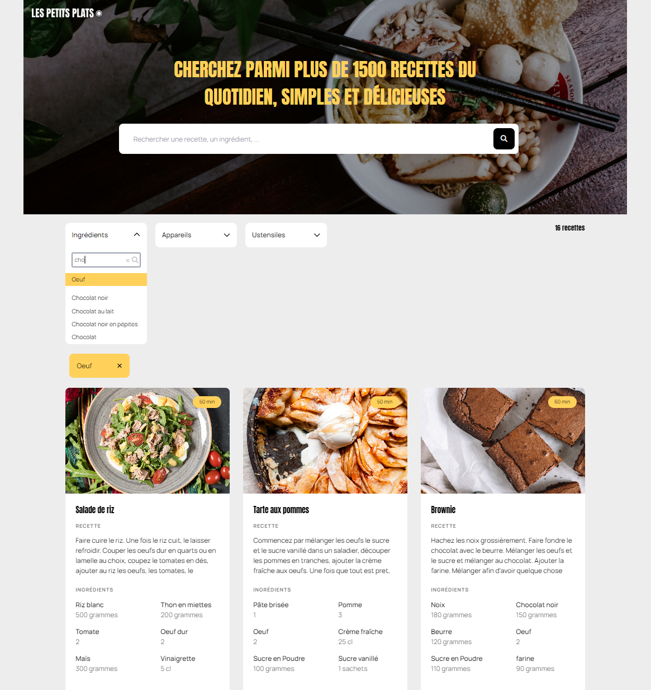

## Description

This project, initiated as part of a software developer training program, aims to develop a high-performance search functionality for a new cooking recipe website.
The implementation of the search feature in JavaScript involve comparing two algorithmic approaches to ensure efficiency and effectiveness and to provide a seamless user experience.

## Licenses

* Fonts
    * Font Awesome : [Font Awesome Free License](https://fontawesome.com/license/free), [CC BY 4.0 License](https://creativecommons.org/licenses/by/4.0/), [SIL OFL 1.1 License](http://scripts.sil.org/OFL), [MIT License](https://opensource.org/licenses/MIT)
    * Anton Font : [SIL OFL License](http://scripts.sil.org/OFL) Designed by Vernon Adams
    * Manrope Font : [SIL OFL License](http://scripts.sil.org/OFL) Designed by Mikhail Sharanda

